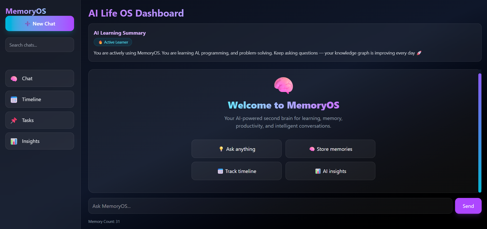
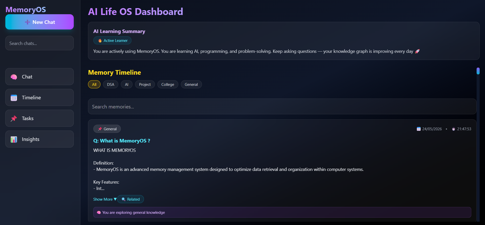
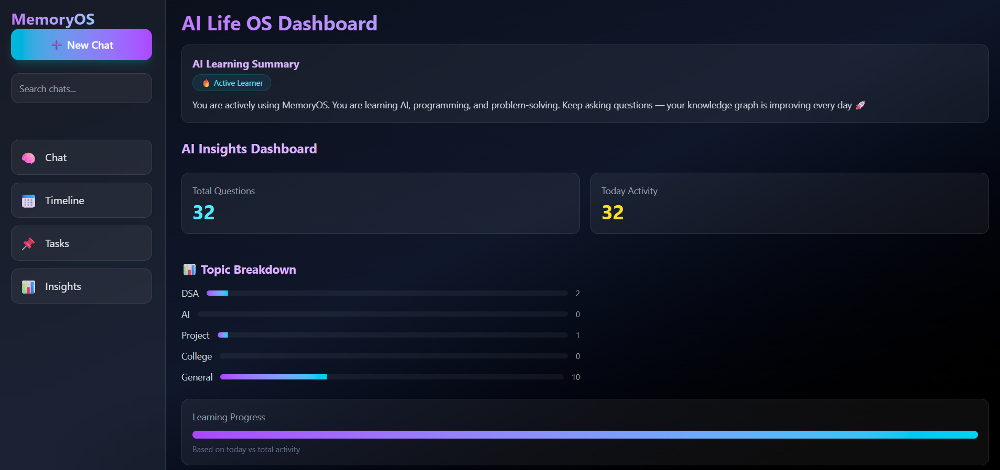
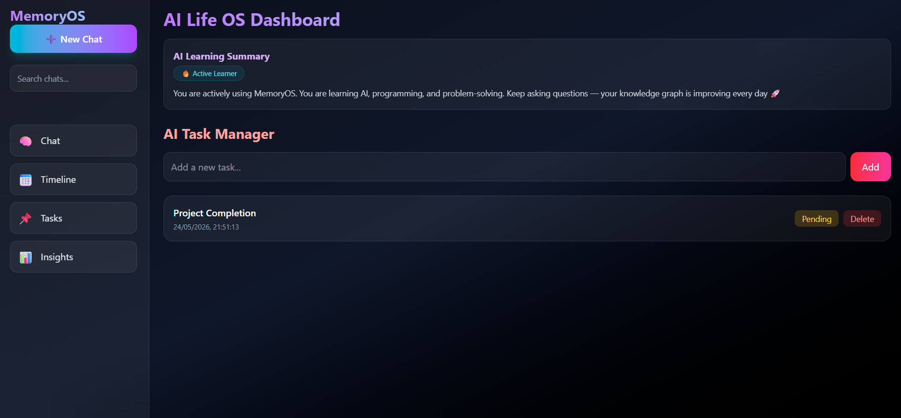
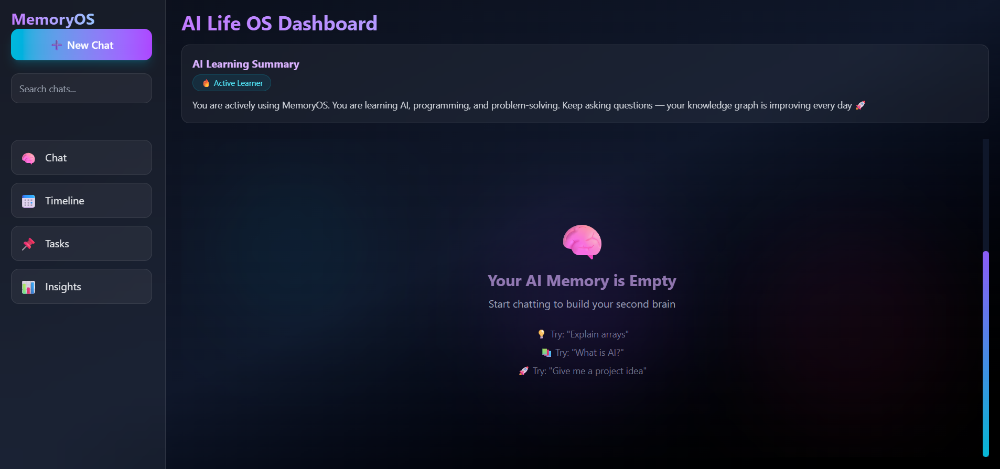

<div align="center">

# 🧠 MemoryOS

### ⚡ Your Personal AI Second Brain Operating System

> “A futuristic AI system that remembers everything you learn, think, and build — and turns it into structured intelligence.”

---

### 🌐 Live Demo  
👉 https://memoryos-second-brain.vercel.app/

---

### 🚀 Status  
🟢 Active Development • 🧠 AI Memory System • ⚡ Frontend Complete

---

### 🛠 Tech Stack


</div>

---

# 🧠 What is MemoryOS?

MemoryOS is a **next-generation AI memory system** that transforms your:

- 💬 Conversations  
- 📚 Learning  
- 🧾 Tasks  
- 🧠 Thoughts  

into a structured **Second Brain System**

---

# ⚡ Core Features

## 💬 AI Memory Chat System
Store conversations with structured intelligence

## 🧠 Smart Memory Engine
Every answer is stored with:
- Topic
- Insight
- Context

## 📅 Timeline View
Your knowledge visualized like a **learning journey**

## 🧾 Task System
Automatically extracted + user tasks

## 🔍 Smart Search
Search and highlight memory instantly

## 🎯 Related Memory Engine
Find similar knowledge instantly

## 📊 AI Insights Dashboard
Analytics of your learning behavior

---

# 📸 Product Screenshots

## 🧠 Dashboard


## 📅 Timeline


## 📊 Insights


## 🧾 Tasks


## 🧠 Empty State


---

# 🔥 Upcoming Vision Roadmap

- 🎤 Voice Input (Speech-to-Text)
- 🔊 AI Voice Responses
- ✨ Typing Animation
- 🌌 Particle Background System
- 📱 Fully Responsive Mobile UI
- 📌 Pinned Memories
- 🧠 AI Smart Suggestions Engine
- 🔥 Daily Streak System
- 📊 Animated Counters
- 🎵 Sound Effects
- 🌗 Dark/Light Mode System
- 🖼 AI Avatar Personalization
- ⚡ Keyboard Shortcuts (Ctrl + K)
- 🧾 Export Memory as PDF
- ☁ Cloud Sync System
- 🔔 Smart Notifications
- 🧠 Memory Graph Visualization
- 🎯 Productivity Score Engine
- 📅 Calendar Integration
- ⏰ Smart Reminders
- 🤖 Personalized AI Personality
- 🎨 Theme Engine
- 🪄 Framer Motion Animations
- ⚡ Skeleton Loading UI
- 📈 GitHub Activity Heatmap
- 🔍 Semantic AI Search
- 🛰 Command Palette (Spotlight UI)
- 🧊 Glassmorphism Everywhere

---

# 🛠 Tech Stack

- ⚛️ React (Vite)
- 🎨 Tailwind CSS
- ⚡ JavaScript (ES6+)
- 💾 LocalStorage
- 🤖 OpenRouter AI API (disabled in production)

---

# 🧠 Vision

> “To build a personal AI operating system that remembers everything you learn, think, and build — becoming your second brain.”

---

## 🚀 Getting Started

```bash
git clone https://github.com/your-username/memoryos-second-brain.git
cd memoryos-second-brain
npm install
npm run dev
👨‍💻 Author

Made with ❤️ by Nimesh

⚠️ Note

This is a frontend-first AI system.
AI backend is currently disabled for safety (no API keys in production).

<div align="center"> <br/>
⚡ MemoryOS — The Future of Personal AI Memory

⭐ If you like this project, give it a star!

<br/> </div> ```